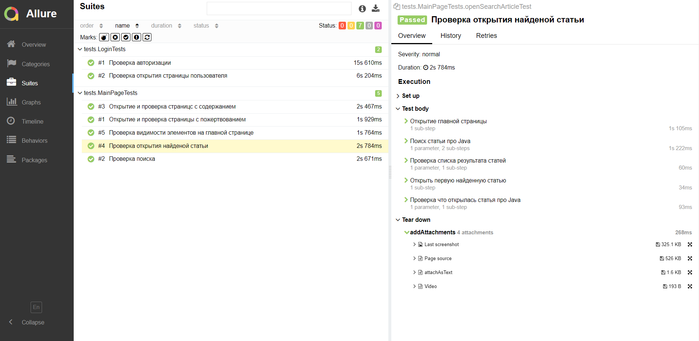

# Дипломный проект по автоматизации тестирования сайта [wikipedia](https://ru.wikipedia.org/)
<p align="center">
<a href="https://olx.kz"></a>
</p>


##	Содержание

- [Технологии и инструменты](#technologist-технологии-и-инструменты)
- [Реализованы проверки](#bookmark_tabs-реализованные-проверки)
- [Запуск тестов из терминала](#computer-запуск-тестов-из-терминала)
- [Запуск тестов в Jenkins](#-запуск-тестов-в-jenkins)
- [Отчет о результатах тестирования в Allure Report](#-отчет-о-результатах-тестирования-в-Allure-report)
- [Уведомления в Telegram с использованием бота](#-уведомления-в-telegram-с-использованием-бота)


## :technologist: Технологии и инструменты

<p align="center">
<code><a href="https://www.jetbrains.com/idea/"></a></code>
<code><a href="https://www.java.com/"></a></code>
<code><a href="https://github.com/"></a></code>
<code><a href="https://junit.org/junit5/"></a></code>
<code><a href="https://gradle.org/"></a></code>
<code><a href="https://selenide.org/"></a></code>
<code><a href="https://web.telegram.org/"></a></code>
<code><a href="https://aerokube.com/selenoid/"></a></code>
<code><a href="https://github.com/allure-framework/"></a></code>
</p>


## :bookmark_tabs: Реализованные проверки:
### UI Tests

- Проверка видимости элементов на главной странице
- Открытие и проверка страницс с содержанием
- Открытие и проверка страницы с пожертвованием
- Проверка поиска
- Проверка открытия найденой статьи
- Проверка авторизации
- Проверка открытия страницы пользователя

## :computer: Запуск тестов из терминала

### Локальный запуск тестов

```bash
gradle clean test
```

### Удаленный запуск тестов

```bash
gradle clean test
-Dbrowser=${browser}
-DbrowserVersion=${browserVersion}
-DbrowserSize=${browserSize}
-DremoteUrl=${remoteUrl}
```

## Параметры сборки


<code>browser</code> – браузер, в котором будут выполняться тесты (_по умолчанию - <code>chrome</code>_).

<code>browserVersion</code> – версия запускаемого браузера, в котором будут выполняться тесты (_по умолчанию - <code>100</code>_).

<code>browserSize</code> – размер окна браузера, в котором будут выполняться тесты (_по умолчанию - <code>1920x1080</code>_).

<code>remoteUrl</code> – адрес удаленного сервера, на котором будут запускаться тесты.

##  Запуск тестов в [Jenkins](https://jenkins.autotests.cloud/job/Khan_qa_ui_test/)

Для запуска сборки необходимо указать значения параметров и нажать кнопку <code><strong>*Собрать с параметрами*</strong></code>.

<p align="center">
  
</p>

После выполнения сборки, в блоке <code><strong>*История сборок*</strong></code> напротив номера сборки появится
значок *Allure Report*, кликнув по которому, откроется страница с сформированным html-отчетом.

<p align="center">
  
</p>


##  Отчет о результатах тестирования в [Allure Report](https://jenkins.autotests.cloud/job/Khan_qa_ui_test/allure/)

<p align="center">
  
</p>
<p align="center">
  
</p>


##  Уведомления в Telegram с использованием бота
После завершения сборки <code>Telegram</code> бот, автоматически обрабатывает и отправляет сообщение с отчетом о прогоне тестов.

<p align="center">

</p>
